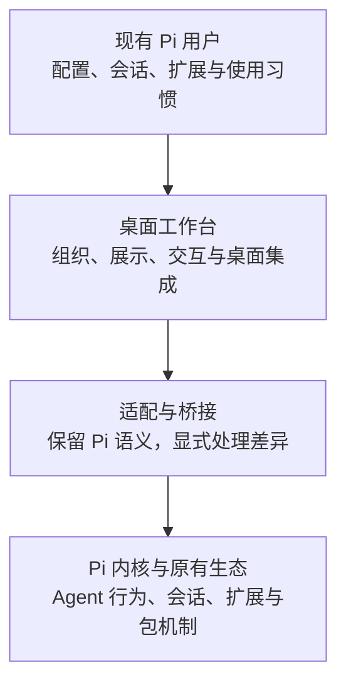

# 产品方向与二开约束

> 适用范围：本仓库长期二开版本。
> 本文记录产品目标与约束，不是当前能力清单，也不构成发布承诺。
> 用户明确提出的方向作为基线；文中标注「建议」「待确认」的事项不得当作已批准需求实施。

## 1. 产品定位

**做一个以 Pi 为内核、兼容 Pi 生态的轻量桌面工作台，让现有 Pi 用户以尽可能低的迁移成本，获得美观、流畅、舒适的日常工作体验。**

主要用户是已有 Pi 使用习惯、配置和扩展的个人开发者，首先服务维护者自己的长期使用。价值在桌面体验，而不是重新发明一个 Agent 框架。

明确方向：

- 保持 Pi 内核、扩展和插件系统，不另建不兼容的替代体系。
- 让 Pi 用户可以无缝迁移，而非重新配置一套工具链。
- 低资源占用、良好性能，以及美观、流畅、舒适的界面交互。

## 2. 产品边界

这是产品职责示意，不是新增模块或重构指令。当前实现参见 [架构概览](./architecture/overview.md) 和 [进程边界](./architecture/process-boundaries.md)。

### 应当做什么

- 把 Pi 已有能力可靠地带到桌面，而不是只做一个漂亮的聊天窗口。
- 改善会话与工作区切换、消息与工具结果阅读、扩展交互、设置管理等日常流程。
- 提供清晰的运行状态、取消入口、错误反馈和恢复路径。
- 在确有价值时加入桌面辅助能力，但不让辅助能力喧宾夺主。

### 非目标

- 自研或长期维护另一套 Pi 内核、Agent 循环、扩展加载体系。
- 要求普通 Pi 扩展为了本应用重新开发，或把桌面专属 API 变成使用门槛。
- 为了功能数量而演变成通用 IDE、协作平台或插件市场。
- 为桌面展示方便，另造一份与 Pi 竞争的会话、配置或执行状态事实源。
- 承诺所有终端交互都能原样映射到 GUI，或未经验证就宣称百分之百兼容。

非目标约束的是发展方向，不要求立即删除仓库已有的文件树、终端、Git 或浏览器等辅助功能。

## 3. 核心产品规则

### P-01：兼容 Pi，而不是替换 Pi

使用 Pi 提供的接口和机制承接 Agent 行为、会话与扩展能力。允许桌面适配和展示增强，但不得悄悄改变底层语义。

涉及 Pi 内核修改、依赖补丁、扩展协议分叉或新的持久化格式时，必须先说明必要性、替代方案、升级成本和退出方式，由维护者确认。不得以「实现更简单」为由默认采取这些方案；本规则也不代表仓库现有补丁已被逐项审查。

### P-02：迁移成本低，原有资产可继续使用

目标是复用 Pi 配置、认证、模型设置、会话、包和扩展，不要求用户手工重建。不强制引入桌面专属账户或云端同步作为本地工作的前提。

兼容不只指「能读文件」，也包括作用域、加载时机、操作结果与错误语义。任何不兼容、需要授权或不能支持的行为，必须在用户依赖它之前明确提示，不能静默忽略或伪装成功。

不因桌面初始化或升级静默覆盖原有 Pi 数据。涉及迁移时，要说明备份、恢复和回退方式。与终端 Pi 同时使用时的数据并发安全，需要单独验证；在验证前不得承诺可安全同时写入。

### P-03：可靠性先于装饰性体验

不丢失或串用会话，不把未完成显示为完成，不把中止请求当作已经中止。错误必须可见、可定位，并提供适当的重试或恢复入口。

界面中「运行中／等待输入／失败／完成」应对应真实状态；不能用动画掩盖状态不确定或数据同步错误。

### P-04：轻量与流畅是持续约束

低占用指整个桌面应用及其子进程，而不仅是前端。需要关注冷启动、空闲资源、长会话、流式输出、工作区切换、后台任务和退出清理。

新增常驻进程、后台轮询、大型依赖、预加载或缓存时，应说明必要性、资源生命周期及代价。影响性能的变更必须提供相同场景下的前后测量；未经测量不得宣称「优化了性能」。

暂不凭空规定内存、启动时间或帧率数字。先建立代表性设备和场景的基线，再由维护者确认预算与回归阈值。外部模型耗时与本地 UI 响应耗时应分开记录。

### P-05：一致、安静、可控的交互

美观服务于可读性和操作效率，而不是堆叠动效。优先沿用现有设计组件和交互模式，避免各功能各自建立一套弹窗、快捷键和状态反馈。

重点检查：长文本和工具结果可读、键盘与焦点行为稳定、滚动不打断阅读、流式更新不抢输入、错误不淹没主流程。涉及输入时验证中文输入法；关键交互兼顾可访问性。

用户应能理解当前操作作用于哪个工作区、哪个会话。不可逆操作需要明确范围和适当确认。

### P-06：桌面增强应当渐进、可选

新功能应能回答：解决哪个真实工作场景？为什么 Pi 原能力或现有 UI 不够？如何证明改善？引入哪些维护成本？

不以「以后可能用得上」为理由搭建通用平台。新的桌面能力不得成为原有 Pi 工作流继续使用的强制条件。

## 4. 兼容性目标与已知差距

以下是需要验证的目标维度，不是已经通过的兼容性矩阵：

| 维度 | 目标 | 验收方向 |
|---|---|---|
| 配置与认证 | 复用已有资产，保留正确作用域 | 使用已有 Pi 环境启动；检查读取、修改和重启后的结果，不在证据中泄露凭据 |
| 会话 | 能继续已有工作，数据保持可用 | 打开已有会话、继续对话、重启恢复，并验证 Pi 端仍可读取 |
| 包与扩展 | 保留原加载机制与行为语义 | 按实际使用的包验证加载、命令、工具、事件和资源生命周期 |
| 扩展 UI | 保留交互功能，允许桌面化展示 | 以代表性扩展验证输入、选择、取消、自定义 UI 和不支持时的反馈 |
| 工作区与项目资源 | 明确作用域及信任边界 | 验证切换、项目级资源策略与跨工作区隔离 |
| Pi 版本升级 | 不因升级破坏核心工作流 | 记录支持版本，运行核心流程和代表性扩展回归 |

**当前已知差距：**[当前 P0 范围](./operations/p0-scope.md) 明确只加载用户／全局包；工作区的 `.pi/extensions` 不会自动运行，Host 使用 `projectTrusted: false`。因此不能宣称已经完全无缝迁移。

这不是立即放开项目代码执行的授权。后续需要专门决定项目资源信任策略，并同时评估兼容性与安全性。其他兼容程度仍需逐项盘点，不能从这份目标文档推断。

## 5. 取舍原则与待确认项

建议的默认取舍顺序：

1. 数据安全、状态正确、Pi 语义兼容。
2. 核心工作流可靠、交互可理解。
3. 性能、资源占用与维护成本。
4. 视觉精致度与新功能数量。

这不是性能或体验可以长期欠账的理由。当目标冲突且无法同时满足时，说明代价交给维护者选择，不自行削弱兼容性。

尚未确定，不应由 AI 自动补全为需求：

- 首要支持的操作系统及各平台体验、发布验收范围。
- 首批必须兼容的 Pi 版本、扩展与使用场景。
- 项目级扩展信任机制，以及 Pi 终端与桌面并用策略。
- 性能基线设备、量化预算与回归阈值。
- 桌面工作台首屏布局、视觉风格和辅助功能优先级。
